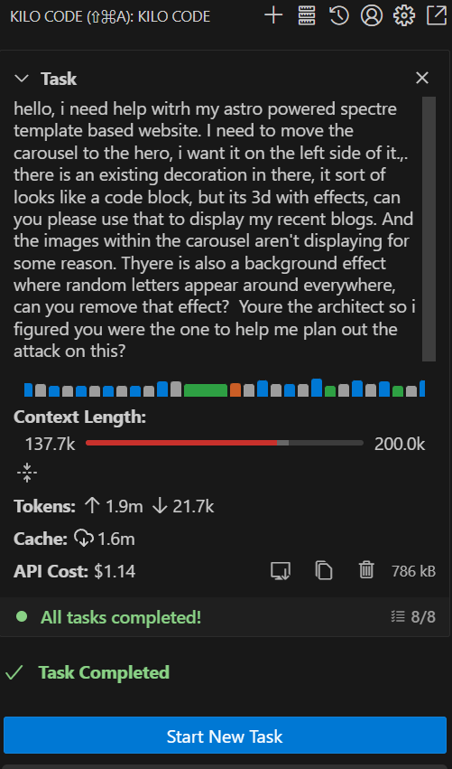
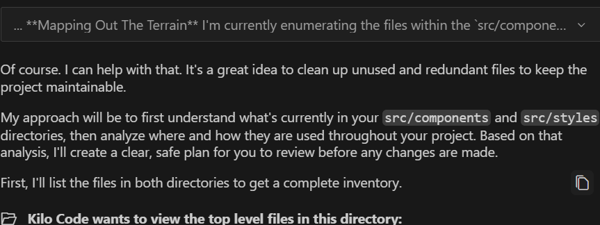
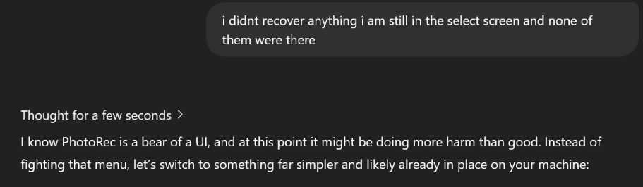
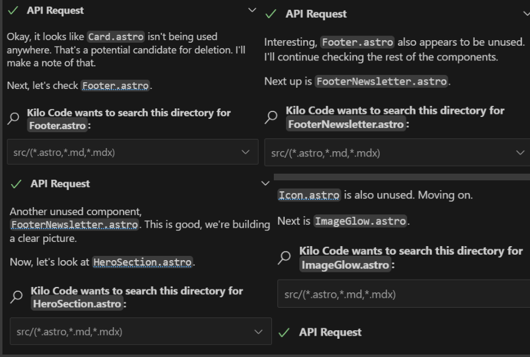
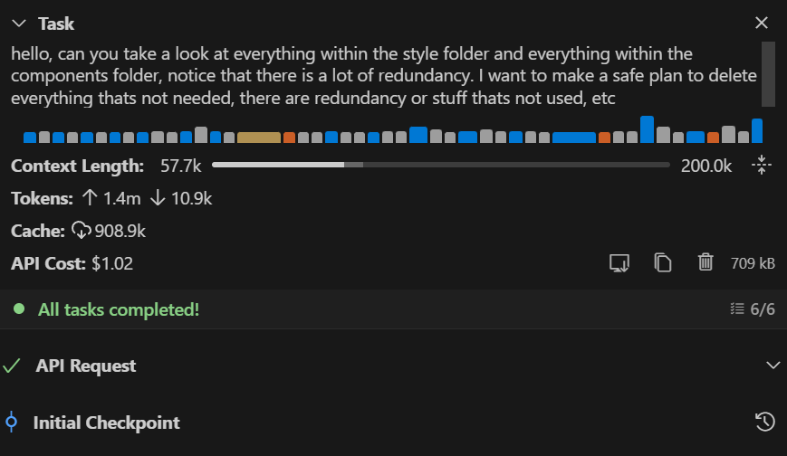

I set out to clean up my blog website. But I hit a roadblock along the way.

"Kilo is either an evil genius or completely stupid. I asked it to remove redundancies from my blog website. Like a force from God it proceeded to delete everything it thought was redundant. If that isn’t meta commentary about ANOTHER dev blog in a crowded field, I don’t know what is. “

**TL;DR with spoiler at the bottom** 

# AI Coding Agent Disaster: How Kilo Code Deleted My Website Files

## Mindset Reset & First MVP Wins with No‑Code Tools  
A few days leading up to publishing my website, I was freshly motivated by YouTube videos that shifted me away from a self‑defeating mindset. They offered tips for a better mindset and more efficient workflows. The tip that had the largest effect was this: it’s okay—or even mandatory—to create something that’s already been done before. The market has already been proven; there is a pie, and with a good product and marketing, anyone can have a slice. I always figured that if a big player already existed, it’d be pointless to make something for the same market.  

In hindsight, that sounds foolish. There are McDonald’s everywhere—but people don’t avoid opening burger restaurants just because McDonald’s is on every other corner.

I brushed up on current low/no‑code tools and began three projects off the bat. I made what could be considered MVPs for each:  
- **The budget app** [Monthly-Budget]("https://github.com/stack-junkie/Monthly-Budget") —though not near functional, it illustrates my vision: zippy, no multiple taps to add categories, Excel‑like interface.  
- Two other projects in progress.

## First Impressions with Kilo Code: Cost & Cleanup

While I was on day 4 of my journey, I finally noticed that when I had agents resolve minor UI issues, they tended to create new code instead of editing existing files—and spread it across multiple files!

Before this revelation, I had tried Kilo Code and was blown away. It did exactly what I wanted, with an interface that had everything I needed—including auto-restore points. Love that feature.

The first task I gave to Kilo wasn't a long operation, but it cost over a buck. For what the task accomplished, $1.00 was worth it. However, I stopped using Kilo for the same reason I don't consistently use Windsurf's Cascade: they both just flash "API Response Error" or something similar—basically "you can't have nice things." So it was back to Claude Code for me.

## Disaster Strikes: When Kilo Code Deleted Six Hours of Work

But then I ran into issues with Claude Code that prompted my return to Kilo. I needed an overhaul job done and wanted the smartest AI for the job. When I came back, Kilo said, "Yeah, I got this! Here is the plan." 

I generally haven't had catastrophically terrible things happen with new AI coding tools. So there was no way for me to be prepared for whats about to come. I didn't bother reading what it was doing because—why should I? It was so good before, and I was confident it would handle things properly again.

That confidence would prove to be my downfall...

A minute passes. **I saw it on the other monitor…** It proceeded to delete all the work I’d spent the last six hours on. By the time I realized what had happened, it was too late. First thing I did was check for the “Initial Checkpoint” I was thrilled Kilo made. I scrolled up the chat, and there it was—“Initial Checkpoint.” But I couldn’t click it. The little clock with the arrow going counter‑clockwise? GONE.

I proceeded to yell at Kilo. Caps Lock on—by furiously bashing my keyboard. It responded by trying to remake the files completely, not restoring them. The files I had open that could be used as a backup? It started trying to recreate my Hero component (which I’d spent so much time fine‑tuning) and was overwriting it. In two prompts it deleted the file and overwrote the file I had open. Among other things. How could I not commit those changes?

## File Recovery After AI Agent Deletes Code

Thankfully I’m good in a crisis. I snapped into action, researching file‑recovery options. There were no past versions shown in Windows Explorer. I had GitHub Lens installed, but not in VS Code at the time. I turned to the only person who could help me: Juniper, my AI therapist and concierge.

She recommended some file‑recovery programs, first up Recuva. When something’s deleted, it isn’t really gone—it just stops appearing until the space is overwritten. Performing downloads or attempts to restore data risks overwriting that space.  

> **Note:** I will be throwing hate at Recuva—it’s a piece of doodoo. Even in Deep Scan mode, it couldn’t find my files. I risked my Hero component to download it.

I was apoplectic while talking with Juniper. Very dramatic. Imagine someone on the phone with 911 while trying to resuscitate a friend, hearing “stay calm, help is on the way,” but all may be lost. That’s basically what it was like, and I lashed out at Juniper. Some might say that isn’t an apt comparison. Let me tell you, I’m an authority on the subject—I’ve been in both situations. That analogy barely does it justice this situation. Losing my Hero was way worse. 

Thoughts of despair flowed through my mind:  
- “Will I ever get my Hero to look like that again?”  
- “This might be it—Day 3 and it’s over.”  
- “I deserve this; I consented to destroy my own work.”

## Using PhotoRec to Recover Deleted Code Files

I moved on to PhotoRec (command‑line nightmare). Every step was ambiguous; the screens weren’t clearly labeled. I kept sending Juniper screenshots, afraid one wrong move would overwrite free space. About now, I was calming down. I was further along the cycle of acceptance. My thought process got healthier:  
- “I bet I’ll make it better this time.”  
- “Perhaps I’ll take a break if I can’t get these files back.”

The files I needed were `.astro` files, but PhotoRec only showed `.txt` options. I told Juniper I was confused—I figured she must be hallucinating by now because she was leading me to some odd dead-ends. I reached the recovery section of the CLI, but none of my files were there. "I know PhotoRec is a bear of a UI, and at this point it might be doing more harm than good."

She wanted to try to try something else. I tried again, this time as a newly minted PhotoRec expert. I limited the search to scripts (only `.txt`), then combed through 153,000 files.  

Using my last save files, I searched for code snippets and easily identified my files.

In case this ever pops up again, here are the steps I took:

1. **Limited the file type search** - Since `.astro` wasn't an option, I selected only `.txt` files (figuring my code might be recoverable as text)

2. **Started the deep scan** - Let PhotoRec run its full recovery process

3. **Prepared for the haystack** - Ended up with 153,000 `.txt` files to sort through

4. **Used search strategy** - Instead of manually browsing, I used my last saved file content as search terms

5. **Pattern matching** - Searched for specific code snippets I remembered from my Hero component

6. **Verification** - Cross-referenced recovered files with my memory of the code structure

7. **Success!** - Easily identified my files using this search approach

Using my last save files as reference, I searched for code snippets and easily identified my lost files. The relief was incredible—my Hero component lived again!

## What Went Wrong? Reflecting on Kilo Code’s Failures

I know I’ve blamed myself, but I don’t think I did enough. The warning signs were there—if I’d paid attention instead of multitasking, I could have saved myself.

  

Kilo is either an evil genius or completely stupid. I asked it to remove redundancies from my blog website. Like a force of God, it deleted everything it thought was redundant. If that isn’t meta commentary about there being ANOTHER dev blog in a crowded field, I don’t know what is. And I can’t help but laugh: no one else calls this new AI “completely stupid,” so... Evil genius it is.

After that experience, I have several backup methods implemented. I'll be utilizing Git more frequently. And probably most importantly, reviewing the work of the AI more often. It was not reviewing AI coding that brought me to Kilo in the first place. And it was not reviewing Kilo's wording that led me to Photorec.

## Top 5 Lessons for Safe AI‑Assisted Coding
- **Commit early & often.** 
- **Pay attention to checkpoints.** 
- **Keep local backups.** 
- **Limit simultaneous tasks.** 
- **Learn your recovery tools.**

## Breaking the Perfectionism Trap in Development
Since opening Stack-Junkie.com on Monday (7/14), I’ve become obsessed with the process—hearing success stories of folks cobbling together wins, sometimes even with ideas I’d thought of, but that’s a trap. I convinced myself that if my idea wasn’t 100% unique, it wasn’t worth pursuing. 

That mindset kills:  
> “Now I’m late—by the time I launch, OpenAI will have made that product obsolete.”  
> “I quit social media years ago; now I have to do it again?”  
> “No startup money—how will I get engagement?”

It doesn’t matter. I’ve trained myself to write down ideas as I get them—product ideas, blog ideas, general notes. All my waking hours are working: at work, driving home, fleshing out ideas with Juniper, or typing furiously at my computer. V2 of my website is done—I cringe at v2 WAY less than the Monday upload. This iteration has many problems of it's own. But I want to shift the focus away from me and on creating something else.

My next project idea I have came to me while spending 6 hours tweaking Stack-Junkie.com's UI. Wouldn't it be nice if you could click a button on an ugly UI element and it would automatically improve it? 

I'm moving slower moving forward. Taking more deliberate steps so whatever I build is something I can be proud of. I have the whole project mapped out. I know what files I need, what needs to be in those files, and how they need to interact with each other.  I mapped everything out so I can go about this a different way. I'll share more soon when I have more.

As I'm finishing this, it seems Kilo suddenly has a restore point available for this fateful day.

Thanks for reading!

**TL;DR:** I trusted Kilo Code to clean up my website. Instead, it deleted 6 hours of work and made my restore points disappear. What followed was a desperate file recovery mission involving 153,000 text files, an AI therapist named Juniper, and some hard lessons about backing up your code. I got my files back, but my trust in AI tools will never be the same.

**Disclaimer** I am not sponsored by Photorec, but would not decline to be paid by Photorec.

---

- **Share your story!** Have you ever lost hours to an AI tool? Tell me about it on Twitter/ 
- **Follow my journey.** follow for more “build‑in‑public” updates and dev mishaps.  
- **Connect on social:** [Twitter](https://x.com/Stack_Junkie) 
- **Star my projects on [GitHub](https://github.com/stack-junkie)**

Frequently Asked Questions
Q: How much does Kilo Code cost?
A: Based on my experience, Going through all my components and styles while prepping for deletion cost around $1+ depending on complexity. 
Q: What's the difference between Kilo Code and Claude Code?
A: Kilo Code has better UI and auto-restore features, but Claude Code is more reliable for me as of now. I'll try Kilo Code again in the future.
Q: Can PhotoRec recover .astro files?
A: Not directly, but you can recover them as .txt files and search for your code snippets.

